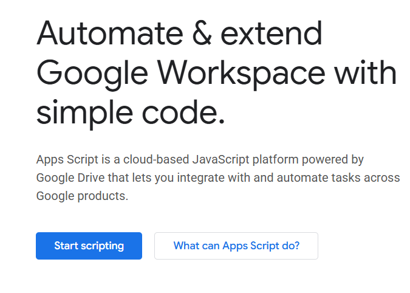
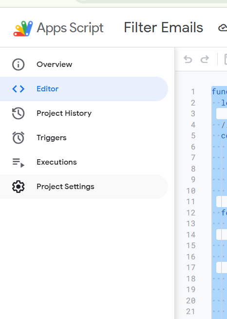

# Email-Filter

# How to setup

step 1:

login to your email

step 2: 

search or copy paste this link
```
https://developers.google.com/apps-script
```

step 3:

click start scripting  


Then New Project on the upper left

step 4: 

copy paste this function and feel free to add or remove some subject filters
```
function filterEmails() {
  let threads = GmailApp.search("is:unread"); //add "from:" and the email of the recipient to specify more

  // mark emails as read if their subject starts with the following:
  const subjectFilters = ["[FMO-Laguna]", "[DIS]", 
                          "[LSPO]", "[LITERATURE]", 
                          "[LIBRARIES]", "[DIPO]",
                          "[OFFICE OF THE PRESIDENT]",
                          "[CDO]", "[OFFICE OF THE VP FOR FINANCE]",
                          "[STRATCOM]", "[OSA]", "Recent Canvas Notifications"]; 
  //to add more phrases or keyword just add a comma and "baby your words po here" before the square bracket  

  for(let thread of threads){
    let messages = thread.getMessages();  

    for(let msg of messages){
      let subject = msg.getSubject();  //gets entire subject line

      if (subjectFilters.some(filter => subject.startsWith(filter))){ 
        thread.markRead();
        break;
      }
    }
  }
}
```

step 5:

go to triggers on the left panel 



step 6:

Click "Add Trigger"

select the function
select Time-driven 
Then decide how often you want it to trigger

